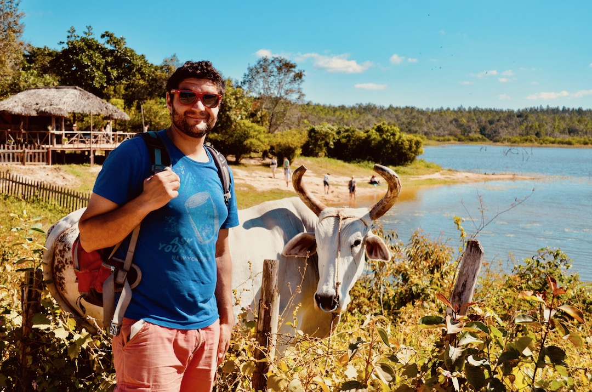

Up until a few years ago it was hard to describe what I do. Luckily, the term data scientist came along which I guess now fits me perfectly! In a nutshell, I spend most of my time looking at data and try to figure out ways to extract useful knowledge from them. This requires applying computational methods from the fields of statistics and machine learning primarily.

When I'm not coding away, I'm probably on my bike, [gig rowing](https://www.youtube.com/watch?v=iy19C0rOjRI), running, kayaking, playing football or travelling!